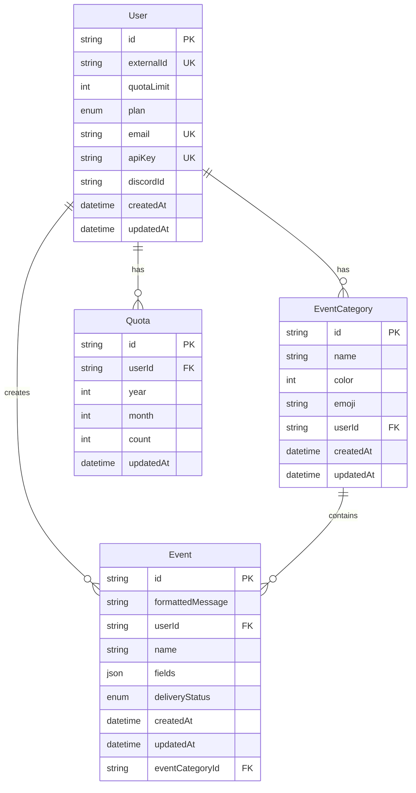

<!-- Title and Description -->
<div align="center">
  <h1>🐨 Koalayst</h1>
  <p><strong>Real-time SaaS Analytics & Discord Integration Platform</strong></p>
  <p>Monitor, analyze, and receive real-time notifications for your SaaS application directly in Discord.</p>
</div>

---
## 🌟 Overview
Koalayst revolutionizes how you stay informed by seamlessly connecting your SaaS applications to Discord. Built for developers and SaaS owners, it delivers instant updates on key activities like new user signups, payments, or custom events—straight to your team's communication hub.

## ✨ Key Features
- **Real-time Event Tracking**: Instantly capture and monitor crucial business events
- **Discord Integration**: Seamless notification delivery to your team's Discord channels
- **Custom Event Categories**: Organize and categorize events with custom colors and emojis
- **Usage Quota Management**: Built-in tracking and plan limitations
- **API Key Management**: Secure access control and authentication
- **Webhook Support**: Easy integration with existing systems

## 🛠️ Tech Stack
- **Frontend & Backend**: Next.js 14 with TypeScript, Shadcn
- **Database**: Serverless PostgreSQL (Neon)
- **ORM**: Prisma with Neon serverless adapter

  
## 💡 Use Cases

### For SaaS Companies
- Track user signups and onboarding progress or any cutom events 
- Monitor subscription changes and payments
- Receive instant notifications about critical events
- Analyze user engagement patterns -> yet to build

### For Development Teams
- Monitor deployment status and system health
- Track API usage and performance metrics
- Receive error notifications in real-time
- Collaborate on incident response

### For Business Operations
- Track sales and conversion metrics
- Monitor customer support tickets
- Analyze user feedback and feature requests
- Track marketing campaign performance

---
$${\color{lightskyblue}Example}$$
- $${\color{lightgreen}Integrate  \space an  \space API \space call  \space to \space trigger \space a \space Discord \space notification \space when \space downtime \space is \space detected \space in \space your \space SaaS \space app.}$$
- $${\color{lightgreen}Receive  \space immediate  \space alerts, \space respond  \space quickly \space and \space a \space maintain \space high  \space service \space relaibility.}$$
---

## 🏗️ Architecture


    
## 🚀 Getting Started

### Environment Variables
Create a `.env` file in the root directory with the following variables:
```env
# Application
NEXT_PUBLIC_APP_URL=your_app_url

# Database
DATABASE_URL=your_database_url

# Authentication
NEXT_PUBLIC_CLERK_PUBLISHABLE_KEY=your_clerk_key
CLERK_SECRET_KEY=your_clerk_secret

# Discord
DISCORD_BOT_TOKEN=your_discord_token
```

## 📦 Installation

1. Clone the repository
```bash
git clone https://github.com/yourusername/koalayst.git
cd koalayst
```

2. Install dependencies
```bash
npm install
```

3. Set up environment variables
```bash
cp .env.example .env
# Fill in your environment variables
```

4. Run database migrations
```bash
npx prisma migrate dev
```

5. Start the development server
```bash
npm run dev
```
---
